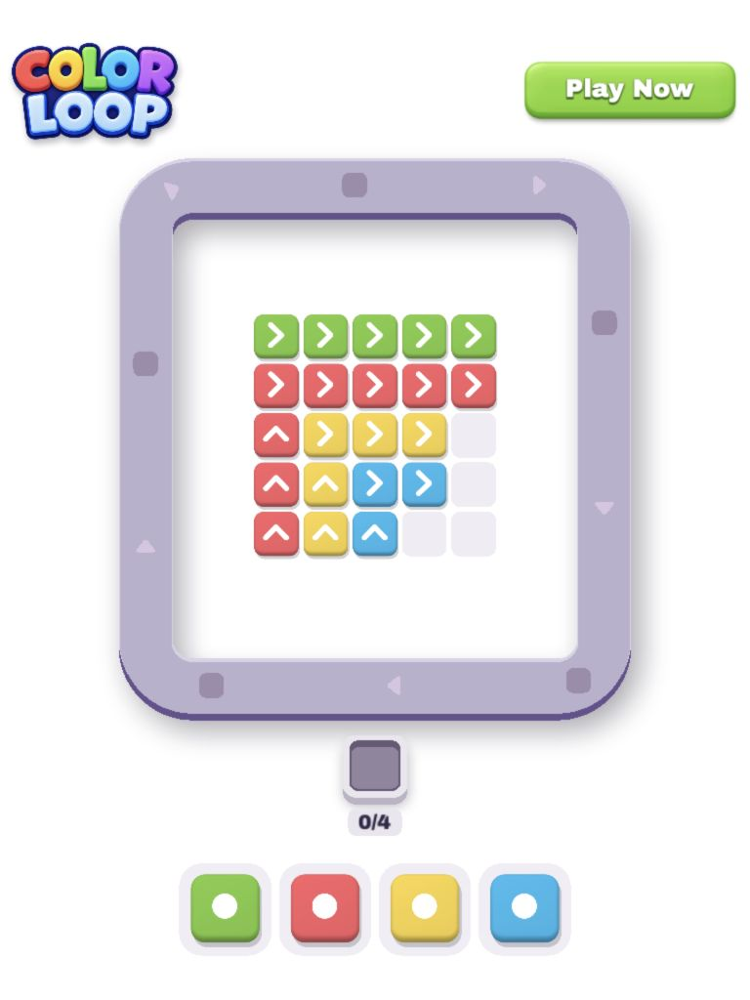
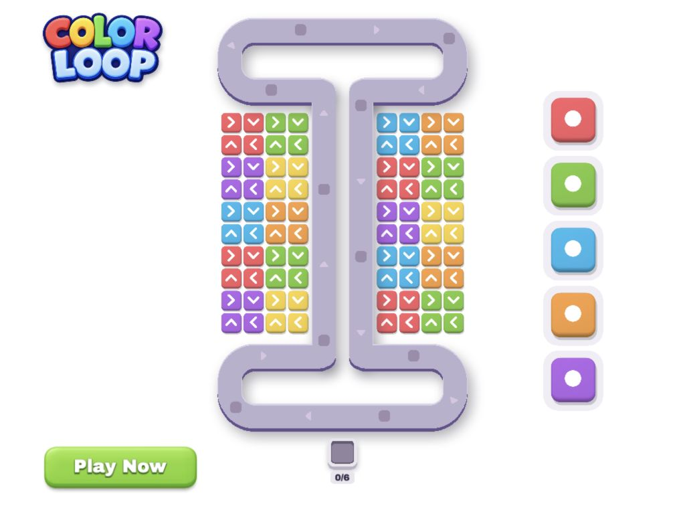

# Color Loop Playable

[](https://github.com/replayablejs/color-loop-playable/actions/workflows/ci.yml)
[](https://opensource.org/licenses/MIT)
[](https://www.typescriptlang.org/)
[](https://openai.com/codex/)

**One codebase. Five gameplay versions. Seven ad networks.**

A color-matching puzzle built with [Replayable](https://github.com/replayablejs/replayable),
PixiJS, and TypeScript. Send colored chips onto a moving conveyor to clear matching
arrow chains. Shared gameplay, artwork, and animations power every version;
configuration selects the level sequence and when the endcard appears.

[Browse previews & download exports](https://replayablejs.github.io/color-loop-playable/)

| Version                | Live preview                                                                                              | Endcard trigger                    |
| ---------------------- | --------------------------------------------------------------------------------------------------------- | ---------------------------------- |
| Starter Ramp           | [Play](https://replayablejs.github.io/color-loop-playable/exports/preview_starter_ramp_en.html)           | After 3 completed levels           |
| Challenge Ramp         | [Play](https://replayablejs.github.io/color-loop-playable/exports/preview_challenge_ramp_en.html)         | After 4 completed levels           |
| Switchback Reveal      | [Play](https://replayablejs.github.io/color-loop-playable/exports/preview_switchback_reveal_en.html)      | After 2 completed levels           |
| Quick Switchback       | [Play](https://replayablejs.github.io/color-loop-playable/exports/preview_quick_switchback_en.html)       | After 1 completed level            |
| Switchback Move Teaser | [Play](https://replayablejs.github.io/color-loop-playable/exports/preview_switchback_move_teaser_en.html) | After 10 accepted color selections |

These links open standalone English previews. The
[catalog](https://replayablejs.github.io/color-loop-playable/) also includes downloadable
HTML and ZIP exports for every configured network. No local setup is needed to try them.

| Switchback Reveal                                                                                                                                        | Quick Switchback                                                                                                               |
| -------------------------------------------------------------------------------------------------------------------------------------------------------- | ------------------------------------------------------------------------------------------------------------------------------ |
|  |  |
| Opens with a four-color staircase puzzle on a rectangular conveyor.                                                                                      | Opens directly on the larger switchback puzzle.                                                                                |

## One game, five creative versions

[config/versions.ts](config/versions.ts) selects the sequence and completion limits
for each version. For example:

```ts
'starter-ramp': {
  params: { game: 'starter-ramp', levelsToEndcard: 3, movesToEndcard: 0 },
},
'switchback-move-teaser': {
  params: { game: 'switchback-move-teaser', levelsToEndcard: 0, movesToEndcard: 10 },
},
```

A zero limit disables that trigger. Accepted selections count across levels;
rejected taps do not count. The tutorial demonstrates the first color selection
and disappears after the player makes one.

The endcard disables gameplay input while queued chips, conveyor movement, matches,
and level transitions continue underneath it. Level-based versions reveal the next
board before showing the endcard.

Replayable builds the configured combinations of **version × language × network**:

- **[5 versions](config/versions.ts)** with different level sequences and endcard triggers.
- **[1 language](config/localization.ts):** English.
- **[8 profiles](config/networks.ts):** Preview plus AppLovin, Meta, Google, Liftoff, Mintegral, Moloco, and Unity.
- **40 exports**, including five standalone browser previews.

The catalog discovers the generated files and displays their formats and sizes.
Adding configured versions or networks requires no handwritten download list.

## What this demonstrates

- PixiJS gameplay with moving conveyor sockets, chip transfers, and animated chain clears.
- Separate level state, movement and crossing calculations, and artwork components.
- Portrait and landscape layouts with safe areas and matching reciprocal aspect-ratio limits.
- A first-interaction tutorial, persistent store CTA, and network-aware endcard behavior.
- Shared chip artwork packed into an atlas, a nine-slice CTA, and cached static artwork with shadows.
- Runtime-managed audio permission, mute, visibility, and pause/resume.

## Assets and loading

Source artwork and audio live in [assets/](assets/). The
[asset configuration](config/assets.ts) generates typed registries, packs chip parts
into an atlas, resizes the logo, and compresses audio to mono at 64 kbps.

| Bundle    | Contents                                    | Loading                                 |
| --------- | ------------------------------------------- | --------------------------------------- |
| Primary   | Artwork, chip atlas, font, and translations | Ready before scene creation.            |
| Secondary | Seven sound effects and the music loop      | Loading starts after the scene appears. |

Secondary loading defers audio decoding without delaying the initial interaction;
those bytes are still included in standalone exports.

Effects accompany selections, rejections, chip landings, matches, transitions,
and level success or failure. Outcome sounds belong to level completion, not to
opening the endcard. A quiet music loop continues through transitions and the endcard.

## Run locally

Requires Node.js 24+ and pnpm 10.32.1. Replayable packages are pinned to published
`0.1.0-alpha.6` releases; no toolkit checkout is required. Catalog and export preview
commands also require Python 3.

```sh
pnpm install --frozen-lockfile
pnpm dev
```

`pnpm dev` starts the default version. To choose a version explicitly, run one of:

```sh
pnpm dev --version starter-ramp
pnpm dev --version challenge-ramp
pnpm dev --version switchback-reveal
pnpm dev --version quick-switchback
pnpm dev --version switchback-move-teaser
```

Run one development server at a time; stop it with `Ctrl+C` before switching versions.
The root [replayable.config.ts](replayable.config.ts) composes these typed sections:

| Configuration                             | Controls                                                  |
| ----------------------------------------- | --------------------------------------------------------- |
| [assets.ts](config/assets.ts)             | Processing, atlas packing, resizing, and loading bundles. |
| [versions.ts](config/versions.ts)         | Level sequences and endcard limits for each version.      |
| [params.ts](config/params.ts)             | Gameplay defaults and tutorial visibility.                |
| [localization.ts](config/localization.ts) | Languages and fallback language.                          |
| [networks.ts](config/networks.ts)         | Delivery profiles included in builds and exports.         |
| [screen.ts](config/screen.ts)             | Portrait/landscape sizing, aspect ratios, and resolution. |
| [controls.ts](config/controls.ts)         | Persistent CTA visibility.                                |
| [devtools.ts](config/devtools.ts)         | Runtime statistics and development controls.              |
| [store.ts](config/store.ts)               | Android and iOS store destinations.                       |

## Build the catalog and exports

Stop the development server first; development and production share generated asset paths.

```sh
pnpm build
pnpm catalog
pnpm catalog:preview
```

Open [the local catalog](http://127.0.0.1:4176/) to try all five previews and download
all 40 exports. Links, formats, and sizes come from Replayable's public export results.

- `dist/<version>/<network>/en/index.html`: built playable variants.
- `exports/`: network-specific HTML and ZIP delivery files.
- `.site/`: the deployable catalog, stylesheet, and downloadable exports.

`pnpm catalog` exports existing builds and generates `.site/`. Missing builds or
export validation errors stop generation. To export without the catalog, run
`pnpm export`; `pnpm preview` serves exports at `http://127.0.0.1:4174/`.

Preview, AppLovin, Meta, Moloco, and Unity produce HTML files. Google, Liftoff, and
Mintegral produce ZIP files. Export names replace version hyphens with underscores,
for example `preview_starter_ramp_en.html` and `google_starter_ramp_en.zip`.
Generated builds, exports, and asset registries are ignored by Git.

Catalog descriptions live in [scripts/catalog/packs.mts](scripts/catalog/packs.mts).
Store buttons intentionally open Unity's Creative Testing app for this showcase;
the destinations are defined in [config/store.ts](config/store.ts).

## CI and deployment

[The GitHub Actions workflow](.github/workflows/ci.yml) runs on pull requests,
pushes to `main`, and manual runs. It installs locked dependencies, builds all
variants, checks formatting/lint/types, and generates the catalog on Linux,
Windows, and macOS. Build runs before type checking to generate asset registries.

Once all three platforms pass, pushes and manual runs on `main` deploy the
Linux-generated `.site/` to GitHub Pages. Pull requests and manual runs on other
branches only validate. The site includes every preview and network export.

Follow builds and deployments in
[GitHub Actions](https://github.com/replayablejs/color-loop-playable/actions).
The [public catalog](https://replayablejs.github.io/color-loop-playable/) is the
deployment destination.

To deploy a fork, select **Settings → Pages → Build and deployment → Source →
GitHub Actions**, then run the workflow from `main`. Update the public links in
this README to your fork's Pages URL. No deployment secret is needed; Pages
permissions are limited to the deployment job.

## Development checks

```sh
pnpm check       # Formatting, lint, and TypeScript checks
pnpm format     # Apply formatting
pnpm lint:fix   # Apply available lint fixes
```

Installing dependencies sets up Husky. Before each commit, lint-staged formats
staged files and checks JavaScript/TypeScript with Oxlint.

## Project structure

- [config/](config/): typed Replayable configuration sections.
- `src/main.ts`: asset readiness, scene mounting, devtools, and secondary loading.
- `src/model/`: level state, color selection, and matching rules.
- `src/gameplay/`: conveyor movement, feeding, and board crossing checks.
- `src/math/`: route sampling and board intersection calculations.
- `src/scene/`: scene composition, level progression, interface, and endcard.
- `src/features/`: board, conveyor, distributor, controls, tutorial, and audio components.
- `src/types/`: shared TypeScript contracts.
- `assets/`: source assets; `src/assets/` is generated by Replayable.
- `scripts/catalog/`: catalog rendering, descriptions, and styling.

## Work on Replayable locally

Use the same local-package workflow as the Music Mixer example. Stop the development
server before connecting or refreshing. Install dependencies in your cloned Replayable
repository first:

```sh
pnpm --dir /path/to/cloned/replayable install --frozen-lockfile
```

Then run these commands from Color Loop:

```sh
# Build and connect the toolkit checkout.
pnpm replayable:local connect /path/to/cloned/replayable

# Rebuild and reinstall after changing toolkit source.
pnpm replayable:local refresh

# Inspect the current connection.
pnpm replayable:local status

# Return to the saved published dependencies.
pnpm replayable:local restore
```

The helper builds and packs the required Replayable packages, including their toolkit
dependencies. Temporary package paths and overrides keep everything on the same local
checkout. It saves the original manifest and lockfile, and refuses to overwrite dependency
files edited after connecting. Restore before committing dependency files.

Color Loop uses published Replayable `0.1.0-alpha.6` packages, including the `release()`
API. A local toolkit checkout is optional and only needed when developing Replayable itself.

`pnpm replayable:local --help` lists options. The helper supports macOS and Linux; use WSL
on Windows.
